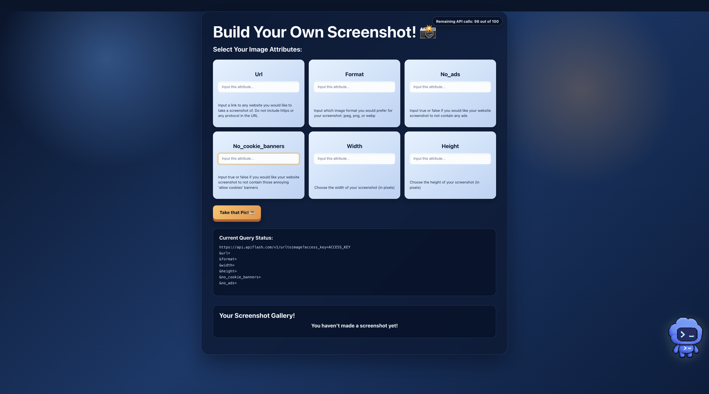
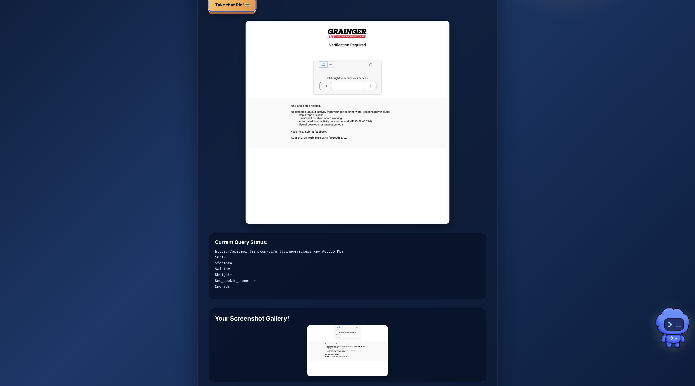

# Cap! 📸

Cap! is a React web app that creates website screenshots with the [ApiFlash API](https://apiflash.com/documentation). Choose a URL and image settings, generate a screenshot, review the API query, and keep a gallery of your previous results.

## Features

- Create screenshots from any website URL.
- Customize image format, width, height, ad removal, and cookie-banner removal.
- Apply sensible defaults for optional settings.
- Display the latest screenshot and retain a gallery of successful requests.
- Show the current query inputs before submission.
- Track the remaining ApiFlash monthly quota.
- Responsive custom interface built with CSS Grid and Flexbox.

## Screenshots

### Empty form



### Filled form and query status


### Generated screenshot and gallery



## Tech stack

- React 19
- Vite 8
- ApiFlash Screenshot API
- CSS Grid and Flexbox

## Getting started

### Prerequisites

- Node.js 20 or newer
- An [ApiFlash account and access key](https://apiflash.com/)

### Install and run

```bash
git clone https://github.com/sravanibhamidipaty/cap.git
cd cap
npm install
cp .env.example .env
```

Add your ApiFlash key to `.env`:

```env
VITE_APP_ACCESS_KEY="your_apiflash_access_key"
```

Start the development server:

```bash
npm run dev
```

Open the local URL printed by Vite, usually `http://localhost:5173`.

## Demo walkthrough

Use this sequence when presenting Cap!:

1. Open the homepage and point out the six screenshot controls.
2. Explain that the query-status panel mirrors the selected parameters in real time.
3. Enter these sample values:

   | Field | Demo value |
   | --- | --- |
   | URL | `example.com` |
   | Format | `jpeg` |
   | No ads | `true` |
   | No cookie banners | `true` |
   | Width | `1280` |
   | Height | `720` |

4. Click **Take that Pic! 🎞**.
5. Show the returned screenshot and explain that successful results are stored in state.
6. Point out the screenshot gallery, which keeps each successful result visible for the current session.
7. Highlight the top-right quota badge, which is loaded at startup and refreshed after each API request.
8. Submit a second URL to demonstrate that the gallery grows while the newest image becomes the main result.

## Available commands

```bash
npm run dev     # Start the Vite development server
npm run build   # Create a production build
npm run lint    # Run Oxlint
```

## API and security notes

Cap! calls ApiFlash with `response_type=json` so the API returns a JSON object containing the screenshot URL. The form also sends `wait_until=network_idle` and fails on selected HTTP status codes.

The `.env` file is intentionally excluded from Git. Vite variables beginning with `VITE_` are included in the browser bundle, so this direct API-key approach is appropriate for a class project or trusted internal tool. For a public production app, call ApiFlash through a backend or serverless proxy so the key remains private.

## Verification

```bash
npm run build
npm run lint
```

Both commands pass in the current project.
